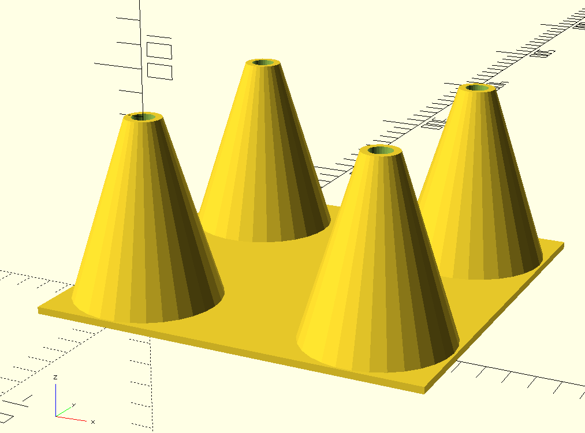

# skimmer-stand

This is a 3d printable stand for a bubble magus curve 5 protein skimmer.  It was originally created by Sean Esopenko.

## Instructions

1. Download & install [OpenSCAD](https://www.openscad.org/)
1. Open skimmer-stand.scad with OpenSCAD
1. Change `targetHeight` to the height you need, in milimeteres.
1. Go to Design->Render
1. File->Export->Export as STL
1. Open STL file with your slicing software (ie: [Cura](https://ultimaker.com/software/ultimaker-cura))
1. Print

## Possible modifications

This stand should be useable with other protien skimmers with 4 feet with some minor modifications:

* `footDistance` is the distance between the center points of each foot of the skimmer.  This should be useable for other skimmers with 4 rubber feet.
* `footWidth` is the width of the rubber feet.  Adjust to the width of your own feet.
* `cupHeight` is the height of the cup for each foot.  Make larger or smaller depending on the height of the rubber feet of your own protein skimmer.

## License

Licensed GNU GPL V3.  A license is included in [LICENCE.txt](LICENSE.txt]).

## Disclaimer

No warranty or guarantee is provided.  Use at your own risk.  Research which plastics are durable and safe to use in a saltwater aquarium. Use your 3D printer safely.